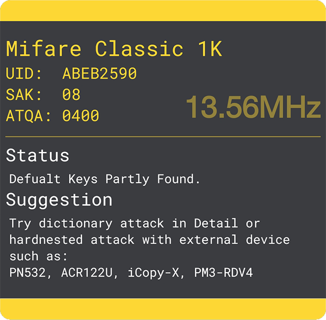

# 帮助与信息 \| MTools

## 1.概述

MTools 是一款可轻松读取、写入、分析和重置 Mifare Classic 标签的 Material 设计 APP。

你首先需要什么：

1. 支持读写 `Mifare 1K`的设备 
   * 内置 NFC
   * USB:  `ACR122U`   `PN532`
   * 蓝牙:  `PN532`
2. 扇区的密钥A与密钥B

**请遵守当地法律，仅作学习与测试使用！**

## 2.YouTube 频道

* [Use MTools to read/write/clone data on Mi Band 3 NFC](https://youtu.be/1Bl-FFALNic)
* [Hack Mifare 1K Card without ACR122U only MTools](https://youtu.be/hEwhJWAt3a8)
* [Burst Attack Mifare 1K Card with MKeys on NFC Android Phone](https://youtu.be/CKSBDwRg7Wo)

## 3. 列表

当在列表界面贴卡时，APP会自动检测卡片类型，并给出基本信息，状态和使用建议。

### 3.1 添加卡片

点击 **+ 浮动按钮** 将会显示添加卡片的对话框，将 Mifare Classic 标签靠近 NFC天线即可。

### 3.2 移除卡片

向右滑动卡片项。

### 3.3 卡片排序

长按并拖动以重新给卡片排序。

### 3.4 卡片过滤

向下拖动可以根据名称、UID、SAK 或时间来过滤卡片。

### 3.5 导入文件

* \*.mto 文件是包含卡片信息，密钥和规则的特殊的 JSON 文件。
* \*.mfd \| \*.bin 文件是由 libnfc库读取的 1K Mifare 转储文件。
* \*.mct 文件是由 Mifare Classic Tools 读取的转储文件。

### 3.6 导出文件

Supports exporting to  5 types: 支持5种类型的文件导出

* `*.mto` 包括扇区，密钥，转储与规则
* `card-list.csv` 包括卡片id、名称、SAK和时间
* `keys.txt` 包括所有添加的密钥
* `sniffer.csv` 包括所有的嗅探记录
* `record.csv` 包括所有的充值记录

## 4. 详情

### 4.1 添加 & 移除扇区

🆕点击  **+** 浮动按钮并选择 `添加扇区` ，再滑动滑块选择扇区号，并填入有效的密钥A 与密钥B，均为 6 个字节\(12个字符\) 。

◀向右滑动扇区项以移除扇区和密钥。

### 4.2 修改密钥

点击 **修改按钮** 将会显示修改密钥对话框， 此时可选择新的扇区或修改现有密钥， 密钥为6个字节\(12个字符\)或为空。点击**完成**保存密钥和扇区号。

### 4.3 读取扇区

将卡片靠近NFC天线后，点击**读取扇区**按钮，将会显示改扇区的4个块数据。此时可修改并写入数据到卡片中。读写卡时请保持卡片靠近NFC天线。

### 4.4 管理规则

* 选中块左侧的复现可以进行批量操作
* 点击**标记按钮**可以开始标记数据
* 点击**复制按钮**可以复制规则到其他块或其他卡片

#### **4.4.1 标记数值位**

字节标记完成后，调节选项与倍率，数值正确后点击下一步。

#### **4.4.2 标记校验位**

标记变化的字节并添加表达式，确保无误后点击OK。

#### **4.4.2.1 已支持运算**

> 基础: + - × ÷
>
> 求余: \#
>
> 逻辑 : xor not
>
> CRC8: crc8, crc8cdma2000, crc8darc, crc8dvbs2, crc8ebu, crc8icode, crc8itu, crc8maxim, crc8rohc, crc8wcdma
>
> CRC16: crc16ccittfalse, crc16arc, crc16buypass, crc16cdma2000, crc16dds110, crc16dectr, crc16dectx, crc16dnp, crc16en13757, crc16genibus, crc16maxim, crc16mcrf4xx, crc16riello, crc16t10dif, crc16teledisk, crc16tms37157, crc16usb, crca, crc16kermit, crc16modbus, crc16x25, crc16xmodem

[了解更多 &gt;&gt;](mtools-app/help-or-add-expression.md#example)

#### **4.4.2.2 表达式排序**

* 按住并上下拖动表达式
* 运算顺序为从上至下

### 4.5 数据嗅探

注意：请先添加正确的密钥。字节标记完成后可以通过高亮的数据进行对比。

### 4.6 扇区排序

长按并上下拖动即可重新排序。

### 4.8 导入转储

点击  **+** 浮动按钮，点击添加转储后，选择文件类型。MTools 所支持的专车类型：



全称为 Mifare Dump，此文件为 PN532 原生命令或相关程序读取到的 1K 转储文件



此格式文件来自于 Proxmark 3 等设备读取出的 1k 转储文件



此文件来自 Mifare Classic Tools 应用程序通过内置 nfc读取的带有扇区号的文本格式转储文件。



## 5. 从卡片读取

点击  **+** 浮动按钮并选择 **从卡片读取**， 此时可以添加更多的密钥并尝试读取卡片内尽可能多的数据，完成后可以保存数据到转储文件。

### 5.1 密钥列表

启动时候会加载默认密钥与用户已添加的密钥。

### 5.2 开始读取

MTools 将会尝试使用密钥列表中的密钥读取卡片尽可能多的扇区数据。

## 6. 充值

### 6.1 设置定额

点击 **+** 按钮可以切换成 **=** 定额。 

### 6.2 预览计算结果

长按**$浮动按钮**可以预览生成的数据和规则信息。

## 7.依赖

感谢以下朋友们对开源社区的贡献，排名不分先后。

* `ikarus23` [MifareClassicTool](https://github.com/ikarus23/MifareClassicTool)  
* `afollestad` [material-dialogs](https://github.com/afollestad/material-dialogs)  
* `markormesher` [android-fab](https://github.com/markormesher/android-fab)  
* `didikee` [AndroidDonate](https://github.com/didikee/AndroidDonate)  
* `Ice-Box` [Ice-Box](http://catchingnow.com)  
* `uccmawei` [FingerprintIdentify](https://github.com/uccmawei/FingerprintIdentify)

