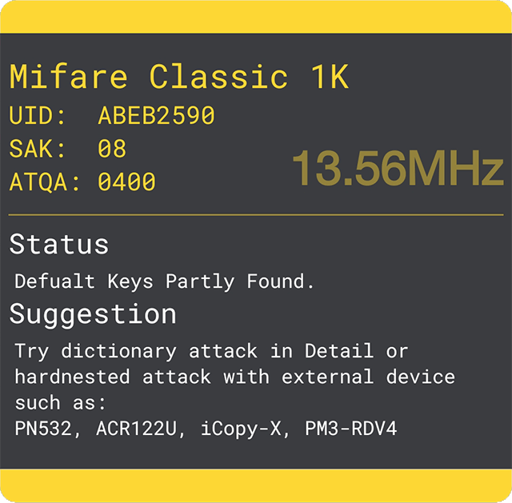

# Help & Info | MTools

## 1.Overview

MTools is a Material Design APP to easily read, write, analyze and charge `Mifare Classic` Tag. What you need firstly:

1. `Mifare 1K`Supported Device. &#x20;
   * Inner NFC
   * USB:  `ACR122U`  `PN532`
   * Bluetooth:  `PN532`
2. KeyA and keyB of the sector.&#x20;

**Please comply with local laws, only used for study and testing.**

## 2.YouTube Chanel




What's Magic Card and How to Clone





MTools read/write/clone data on Mi Band 3 NFC





&#x20;All-in-one PN532 | USB & BLE





Read card with ACR122U on Android phone




## 3. Lists

When the tag card on the list page, the tag info dialog will pop up. It will show status and suggestions depending on your card type.

### 3.1 Add Card

Click the **+ floating button** will display `Add Card Dialog`, put the Mifare Classic Card close to the NFC antenna, then you can add a card to the APP.

### 3.2 Remove Card

Slide the item toward the right to remove the card.

### 3.3 Sort Card

Press and drag to sort cards.

### 3.4 Filter Card

Drag down the list to filter cards by name, UID, SAK, or DateTime.

### 3.5 Import File

* \*.mto file is the specific JSON file that includes tag information, keys, and rules.
* \*.mfd | \*.bin file is the Mifare dump file read by libnfc library.
* \*.mct file is the dump file read by Mifare Classic Tool.

### 3.6 Export File

Supports exporting to  5 types:&#x20;

* `*.mto` Includes card sectors, dumps, and rules.
* `card-list.csv` Includes card, id, name, SAK, and DateTime.
* `keys.txt` Includes all keys added.
* `sniffer.csv` Includes all sniffer records.
* `record.csv` Includes all charging records.

## 4. Details

### 4.1 Add & Remove Sector

:new:Click the **+** floating butto**n** and choose `Add 1 Sector`, select the sector number by sliding the picker, and enter 6 bytes (12 characters) valid key A or key B, click `Complete` to save.

:arrow\_backward:Slide the item toward the right to remove the sector and keys.

### 4.2 Modify Key

Click the **modify button** will display the `Modify Key Dialog`, select new sector number by sliding the picker, and modify the 6 bytes (12 digits or letters) valid key A or key B, click `Complete`save new keys or sector.

### 4.3 Read Sector

After the card is close to the NFC antenna, click on the **read button** will read 4 blocks of data from the clicked sector, you can modify and write the new data.

### 4.4 Manage Rule

* Check on the checkbox for the block to handle.
* Click on **MARK** to mark selected blocks.
* Click on **COPY TO** to copy the rule to another card.

#### **4.4.1 Mark Money Byte**

Mark the byte, then verify the money is correct, and click Next.

#### **4.4.2 Mark Checked Byte**

Check the bytes that change and add expressions. Make sure that it's correct then click OK.

#### **4.4.2.1 Supported operations:**

> Basic: + - × ÷
>
> Advanced : #
>
> Logical : xor not
>
> CRC8: crc8, crc8cdma2000, crc8darc, crc8dvbs2, crc8ebu, crc8icode, crc8itu, crc8maxim, crc8rohc, crc8wcdma
>
> CRC16: crc16ccittfalse, crc16arc, crc16buypass, crc16cdma2000, crc16dds110, crc16dectr, crc16dectx, crc16dnp, crc16en13757, crc16genibus, crc16maxim, crc16mcrf4xx, crc16riello, crc16t10dif, crc16teledisk, crc16tms37157, crc16usb, crca, crc16kermit, crc16modbus, crc16x25, crc16xmodem

[Know More >>](mtools-app/help-or-add-expression.md#example)

#### **4.4.2.2 Sort Expressions**

Press and drag to sort Expressions.

The calculation is from top to end.

### 4.5 Data Sniffer

Must add correct keys before. After marked, it can be compared with highlight data.\
Data Backups/Restore, Compare vertically, Rule Repository.

### 4.6 Sort Sector

Press and drag to sort sector.

### 4.8 Import Dump

Click the **+** floating button, `Add Dump File` choose dump type then select file. The dump file type MTools support:&#x20;



Mifare Dump is a 1K size file that is read by PN532 with the libnfc tools.



1K size file that is read from Mifare 1K card by Proxmark 3 devices.



Text type dump file from`Mifare Classic Tools` app.



## 5. Read From Card

Click the **+** floating button and choose `Read From Card`,  you can add more keys and try to read as much data as possible from the card, and then save it to a dump file.

### 5.1 Key List

Start with default keys and customed keys added by users

### 5.2 Start To Read

Try to read as much as possible data with all keys in Key List.

## 6. Charge

### 6.1 Set Quotas

Click **+** button to change to **=** as Quotas.&#x20;

### 6.2 Clear Record

Long press **the recharge record list**, then pop up the dialog will allow you to clear the recharge record or not.

### 6.3 Show Calculate Result

Long press the floating button to preview the data generated on **Rule**.

## 7.Dependency

Thanks to the friends for the contribution to the open-source community, regardless of rank.

* `ikarus23` [MifareClassicTool](https://github.com/ikarus23/MifareClassicTool) &#x20;
* `afollestad` [material-dialogs](https://github.com/afollestad/material-dialogs) &#x20;
* `markormesher` [android-fab](https://github.com/markormesher/android-fab) &#x20;
* `didikee` [AndroidDonate](https://github.com/didikee/AndroidDonate) &#x20;
* `Ice-Box` [Ice-Box](http://catchingnow.com) &#x20;
* `uccmawei` [FingerprintIdentify](https://github.com/uccmawei/FingerprintIdentify)
