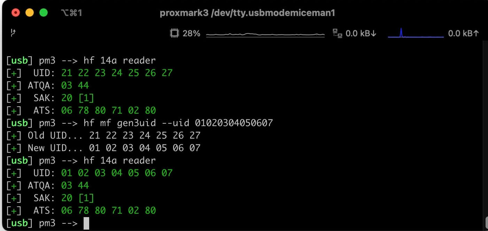
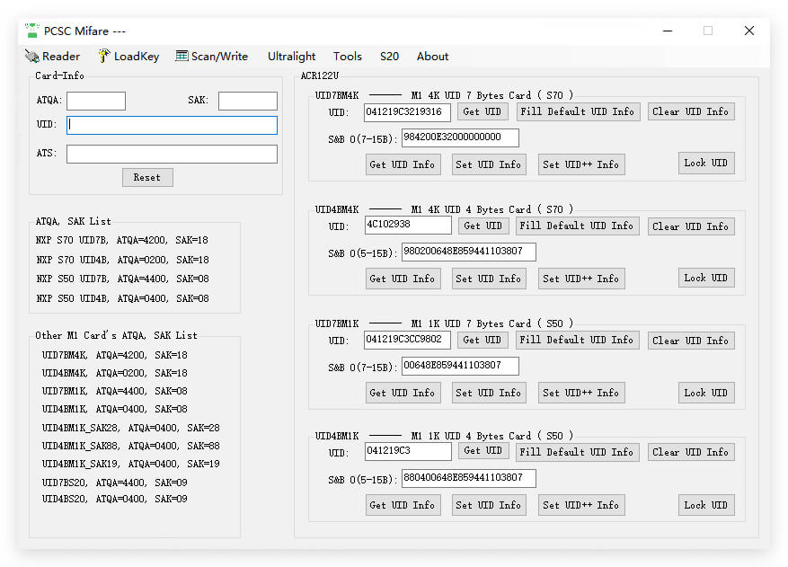

# Change UID of Gen3 Magic Card(Deprecated)

### ## Notice

The UID Changing functions for Gen3 have been upgraded to [UID Changer](how-to-use-uid-changer.md).&#x20;

### Gen3 Magic Card Introduction

Proxmark3 firstly supports the 3rd generation of magic cards. The Gen3 Magic Cards include the cards below:

* [Mifare S70 with 7 Byte UID](https://shop.mtoolstec.com/product/7-byte-uid-s70-4k-magic-key-fob)
* [Mifare S70 with 4 Byte UID](https://shop.mtoolstec.com/product/4-byte-uid-s70-4k-magic-key-fob)
* [Mifare S50 with 7 Byte UID](https://shop.mtoolstec.com/product/7-byte-uid-s50-1k-magic-key-fob)
* [Mifare S50 with 4 Byte UID](https://shop.mtoolstec.com/product/uid-changeable-nfc-mifare-s50-keychain)
* [Mifare S20 with 7 Byte UID](https://shop.mtoolstec.com/product/7-byte-uid-changeable-mifare-mini-s20-card)
* [Mifare S20 with 4 Byte UID](https://shop.mtoolstec.com/product/4-byte-uid-changeable-mifare-mini-card)

### Supported Readers

1. [All-in-one PN532](https://shop.mtoolstec.com/product/mtools-all-in-one-pn532)  - The PN532 Reader with Bluetooth Extension Board.
2. [PCR532](https://shop.mtoolstec.com/product/pcr532) - The smallest PN532 Reader with Bluetooth.
3. [DIY PN532 Board with Bluetooth Module.](https://shop.mtoolstec.com/how-to-make-pn532-work-on-bluetooth.html)

### How does it work with Proxmark3?

Proxmark3 support changed with the UID of the Gen3A magic card with commands quickly.

```
hf mf gen3uid --uid 11223344556677
```

This command can be run with the Command line tool or GUI Program on [Proxmark3 X](https://shop.mtoolstec.com/product/proxmark3-x) or [iCopy-XS](https://shop.mtoolstec.com/product/icopy-xs).&#x20;

<figure><figcaption></figcaption></figure>

### How does it work with ACR122U?

The PCSC Program is a Windows Program for changing the UID of the Gen3 Magic card. Learn more about this program at the link below.



<figure><figcaption></figcaption></figure>

### How does it work with All-in-one PN532?

MTools Lite App supports changing the UID of the Gen1 and Gen3 Magic Card in the Terminal Tools. This can be the first App to change the UID of the gen3 Magic Card on both Android and iOS devices.

<figure><figcaption><p>MTools Lite Terminal</p></figcaption></figure>

