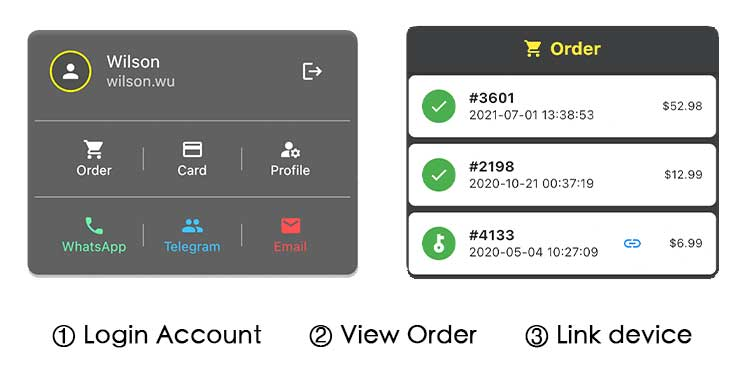

# How To Unlock

## In-App Purchase

MTools Lite app is available on Play Store and App Store. The platform will charge from the client directly. The price of In-App Purchase may be different under different currencies.

There is no limit for devices under same account.

If you have purchased before, just click restore transaction to access full features.

## Activation Code

MTools Lite app also supports the activation code for the MTools app. It can be unlocked and unbonded on 1 Android device and 1 iOS device. 

### How to bind device

1. Log in with the account on [https://shop.mtoolstec.com](https://shop.mtoolstec.com).
2. View all orders.
3. Bind the device.

### Why can not bind

* Already unlocked.
* There is no order contains MTools Activation Code.
* Already bind on another device. It needs to unbind from the original device firstly.
