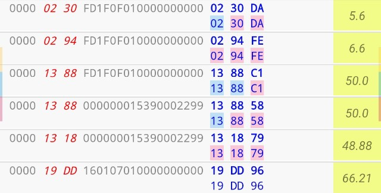

# CRC-8 & CRC-16

CRC - Cyclic Redundancy Check is widely used in data transition. According to `wikipedia.org`, A CRC-enabled device calculates a short, fixed-length binary sequence, known as the check value or CRC, for each block of data to be sent or stored and appends it to the data, forming a codeword.

`When a codeword is received or read, the device either compares its check value with one freshly calculated from the data block, or equivalently, performs a CRC on the whole codeword and compares the resulting check value with an expected residue constant.  
If the CRC values do not match, then the block contains a data error.`

It's really hard to calculate CRC value by hand, so we add CRC8 & CRC16 algorithm in [MTools](https://play.google.com/store/apps/details?id=tk.toolkeys.mtools).  
And this can really save your time to get the CRC values by one expression.  
_**Notice: This is the feature from the full version.**_

## Byte values

There exist 16 bytes on each block of the Mifare 1k card.  
And you can use `b0` `b1` `b2` ... `b14` `b15` for calculation.

## CRC-8

The value of the CRC-8 result is only 1 byte.  
Supported CRC8 algorithm in MTools.

| Algorithm | Expression | Value |
| :--- | :--- | :--- |
| CRC-8 | crc8\(**0,1,5,8**\) | CRC8 of HEX String of `b0` `b1` `b5` `b8` |
| CRC-8/CDMA2000 | crc8cdma2000\(**0:14**\) | CRC8-/CDMA2000 of `b0` to `b14` |
| CRC-8/DARC | crc8darc\(**0:14**\) | idem |
| CRC-8/DVB-S2 | crc8dvs2\(**0:14**\) | idem |
| CRC-8/EBU | crc8eu\(**0:14**\) | idem |
| CRC-8/I-CODE | crc8icode\(**0:14**\) | idem |
| CRC-8/ITU | crc8itu\(**0:14**\) | idem |
| CRC-8/MAXIM | crc8maxim\(**0:14**\) | idem |
| CRC-8/ROHC | crc8rohc\(**0:14**\) | idem |
| CRC-8/WCDMA | crc8wcdma\(**0:14**\) | idem |

## CRC-16

The value of CRC16 contains 2 bytes.  
To get these two separately, `0` or `1` need to be added after the expression.  
Supported CRC16 algorithm in MTools.

| Algorithm | Expression 0 | Expression 1 | Xor Value |
| :--- | :--- | :--- | :--- |
| CRC-16/CCITT-FALSE | crc16ccittfalse\(0:14\)0 | crc16ccittfalse\(0:14\)1 | crc16ccittfalse\(0:14\) |
| CRC-16/ARC | crc16arc\(0:14\)0 | crc16arc\(0:14\)1 | crc16arc\(0:14\) |
| CRC-16/AUG-CCITT | crc16augccitt\(0:14\)0 | crc16augccitt\(0:14\)1 | crc16augccitt\(0:14\) |
| CRC-16/BUYPASS | crc16buypass\(0:14\)0 | crc16buypass\(0:14\)1 | crc16buypass\(0:14\) |
| CRC-16/CDMA2000 | crc16cdma2000\(0:14\)0 | crc16cdma2000\(0:14\)1 | crc16cdma2000\(0:14\) |
| CRC-16/DDS-110 | crc16dds110\(0:14\)0 | crc16dds110\(0:14\)1 | crc16dds110\(0:14\) |
| CRC-16/DECT-R | crc16dectr\(0:14\)0 | crc16dectr\(0:14\)1 | crc16dectr\(0:14\) |
| CRC-16/DECT-X | crc16dectx\(0:14\)0 | crc16dectx\(0:14\)1 | crc16dectx\(0:14\) |
| CRC-16/DNP | crc16dnp\(0:14\)0 | crc16dnp\(0:14\)1 | crc16dnp\(0:14\) |
| CRC-16/EN-13757 | crc16en13757\(0:14\)0 | crc16en13757\(0:14\)1 | crc16en13757\(0:14\) |
| CRC-16/GENIBUS | crc16genibus\(0:14\)0 | crc16genibus\(0:14\)1 | crc16genibus\(0:14\) |
| CRC-16/MAXIM | crc16maxim\(0:14\)0 | crc16maxim\(0:14\)1 | crc16maxim\(0:14\) |
| CRC-16/MCRF4XX | crc16mcrf4xx\(0:14\)0 | crc16mcrf4xx\(0:14\)1 | crc16mcrf4xx\(0:14\) |
| CRC-16/RIELLO | crc16riello\(0:14\)0 | crc16riello\(0:14\)1 | crc16riello\(0:14\) |
| CRC-16/T10-DIF | crc16t10dif\(0:14\)0 | crc16t10dif\(0:14\)1 | crc16t10dif\(0:14\) |
| CRC-16/TELEDISK | crc16teledisk\(0:14\)0 | crc16teledisk\(0:14\)1 | crc16teledisk\(0:14\) |
| CRC-16/TMS37157 | crc16tms37157\(0:14\)0 | crc16tms37157\(0:14\)1 | crc16tms37157\(0:14\) |
| CRC-16/USB | crc16usb\(0:14\)0 | crc16usb\(0:14\)1 | crc16usb\(0:14\) |
| CRC-A | crc16a\(0:14\)0 | crc16a\(0:14\)1 | crc16a\(0:14\) |
| CRC-16/KERMIT | crc16kermit\(0:14\)0 | crc16kermit\(0:14\)1 | crc16kermit\(0:14\) |
| CRC-16/MODBUS | crc16modbus\(0:14\)0 | crc16modbus\(0:14\)1 | crc16modbus\(0:14\) |
| CRC-16/X-25 | crc16x25\(0:14\)0 | crc16x25\(0:14\)1 | crc16x25\(0:14\) |
| CRC-16/XMODEM | crc16xmodem\(0:14\)0 | crc16xmodem\(0:14\)1 | crc16xmodem\(0:14\) |

## CRC-8 / CRC16 in Sniffer

The expression of the last byte `b15` is `CRC-8/MAXIM`, and the results are calculated correctly in a second. 

