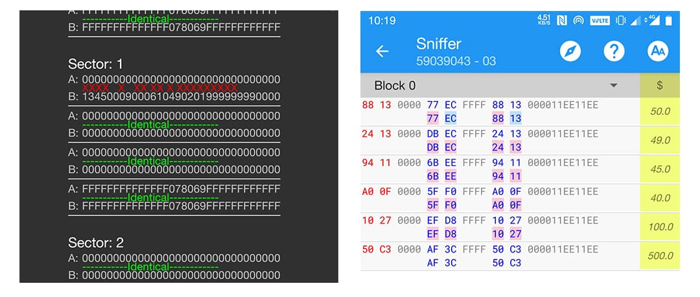

# Mifare Classic Tool vs MTools

## Supported Card

* R - Read
* W - Write
* C - Clone

|  | Mifare Classic Tool | MTools |
| :---: | :---: | :---: |
| Mifare Classic 1K | R / W | R / W |
| Mifare Classic 4K | R / W | R / W |
| 1st gen Magic Card | R / W | R / W / C |
| 2nd gen Magic Card | R / W | R / W / C |
| UFUID Card | R / W | R / W / C |
| Mifare Ultralight |  | R / W / C |
| NTAG |  | R / W / C |
| 羊城通 |  | R |
| More Cards |  | Coming Soon |

## **External Device**

<table>
  <thead>
    <tr>
      <th style="text-align:center"></th>
      <th style="text-align:center">Mifare Classic Tool</th>
      <th style="text-align:center">MTools</th>
    </tr>
  </thead>
  <tbody>
    <tr>
      <td style="text-align:center">ACR122U</td>
      <td style="text-align:center">
        
Compatible

        
<code>&#x2022; Rooted need</code>
        

        
<code>&#x2022; Plugin require </code>
        

      </td>
      <td style="text-align:center">USB Connection
         <code>Built-in driver</code>
      </td>
    </tr>
    <tr>
      <td style="text-align:center">PN532</td>
      <td style="text-align:center">Not support</td>
      <td style="text-align:center">USB Connection</td>
    </tr>
    <tr>
      <td style="text-align:center">PN532 Bluetooth</td>
      <td style="text-align:center">Not Support</td>
      <td style="text-align:center">Bluetooth Connection</td>
    </tr>
  </tbody>
</table>

## **Card Clone**

The real cloning of the Mifare classic card must have a changeable UID.

<table>
  <thead>
    <tr>
      <th style="text-align:center">Magic Card Type</th>
      <th style="text-align:center">Mifare Classic Tool</th>
      <th style="text-align:center">MTools</th>
    </tr>
  </thead>
  <tbody>
    <tr>
      <td style="text-align:center">UID</td>
      <td style="text-align:center">Not Support</td>
      <td style="text-align:center">
        
Support

        
<code>Require External Device</code>
        

      </td>
    </tr>
    <tr>
      <td style="text-align:center">CUID</td>
      <td style="text-align:center">Support</td>
      <td style="text-align:center">Support</td>
    </tr>
    <tr>
      <td style="text-align:center">UFUID</td>
      <td style="text-align:center">Not Support</td>
      <td style="text-align:center">
        
Support

        
<code>Require External Device</code>
        

      </td>
    </tr>
  </tbody>
</table>

## Operation Features

<table>
  <thead>
    <tr>
      <th style="text-align:center">Magic Card Type</th>
      <th style="text-align:center">Mifare Classic Tool</th>
      <th style="text-align:center">MTools</th>
    </tr>
  </thead>
  <tbody>
    <tr>
      <td style="text-align:center">Reading</td>
      <td style="text-align:center">All sectors</td>
      <td style="text-align:center">
        
All Sectors

        
Single Sector

      </td>
    </tr>
    <tr>
      <td style="text-align:center">Writing</td>
      <td style="text-align:center">Dump to sectors</td>
      <td style="text-align:center">
        
Dump to sectors

        
Sector to sector

      </td>
    </tr>
    <tr>
      <td style="text-align:center">Cloning</td>
      <td style="text-align:center">Only CUID card</td>
      <td style="text-align:center">All UID Changeable Card</td>
    </tr>
    <tr>
      <td style="text-align:center">Analyzing</td>
      <td style="text-align:center">Between 2 dumps</td>
      <td style="text-align:center">Between 24 blocks</td>
    </tr>
    <tr>
      <td style="text-align:center">Highlighting</td>
      <td style="text-align:center">1 Standard Structure</td>
      <td style="text-align:center">
        
5 built-in structure

        
User can add more

      </td>
    </tr>
    <tr>
      <td style="text-align:center">Calculating</td>
      <td style="text-align:center">Not Support</td>
      <td style="text-align:center">mXparser</td>
    </tr>
    <tr>
      <td style="text-align:center">Charging</td>
      <td style="text-align:center">Not Support</td>
      <td style="text-align:center">One-click</td>
    </tr>
  </tbody>
</table>

## Data Comparision

| Mifare Classic Tool | MTools |
| :---: | :---: |
| Between 2 blocks in 2 dumps | Among 24 blocks |

## Dump Type

|  | Mifare Classic Tool | MTools |
| :---: | :---: | :---: |
| text | Support | Support |
| mfd | Support | Support |
| bin | Support | Support |

## **Import/Export Type**

<table>
  <thead>
    <tr>
      <th style="text-align:center"></th>
      <th style="text-align:center">Mifare Classic Tool</th>
      <th style="text-align:center">MTools</th>
    </tr>
  </thead>
  <tbody>
    <tr>
      <td style="text-align:center"><b>Import</b>
      </td>
      <td style="text-align:center">
        
<code>&#x2022; Dump File</code>
        

        
<code>&#x2022; Keys File</code>
        

      </td>
      <td style="text-align:center">
        
<code>&#x2022; Dump File</code>
        

        
<code>&#x2022; Keys File</code>
        

        
<code>&#x2022; Card Rule</code>
        

      </td>
    </tr>
    <tr>
      <td style="text-align:center"><b>Export</b>
      </td>
      <td style="text-align:center">
        
<code>&#x2022; Dump File</code>
        

        
<code>&#x2022; Keys File</code>
        

      </td>
      <td style="text-align:center">
        
<code>&#x2022; Card Rule</code>
        

        
<code>&#x2022; Card List</code>
        

        
<code>&#x2022; Dump File</code>
        

        
<code>&#x2022; Keys List</code>
        

        
<code>&#x2022; Charging Record</code>
        

      </td>
    </tr>
  </tbody>
</table>

## Bcc Calculator

| Mifare Classic Tool | MTools |
| :---: | :---: |
| Inner Calculator | Auto calculate |

## Access Condition De-/Encoder

| Mifare Classic Tool | MTools |
| :---: | :---: |
| Inner Calculator | Not Support |

