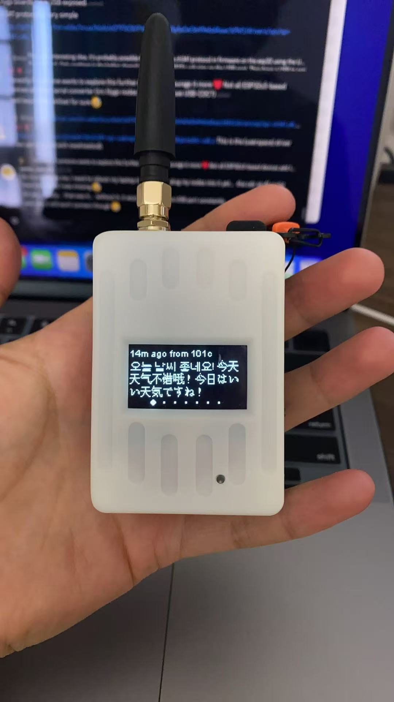

# 如何为GAT562升级 Meshtastic原版和中文固件


\
感谢 MeshCN 社区伙伴的支持，现如今Meshtastic官方已支持 GAT562的固件支持，最新的固件都会发布并同步在[https://github.com/meshtastic/firmware/releases](https://github.com/meshtastic/firmware/releases) 的仓库中。

以往的 nRF52840 Meshtastic设备或 GAT562 的固件升级方法有2种方式，

1. USB连接拓展从Github下载后解包出来适合GAT562的`uf2`文件
2. 通过nRF的`DFU App` 蓝牙上传从从Github下载后解包出来适合 GAT562 的`ota.zip`文件

如今 MTools BLE 已支持 GAT562 固件的一键下载和快速的Legacy DFU更新，整个过程大概花费3分钟。

<figure><figcaption></figcaption></figure>

### 升级官方最新固件

1. 前往`工具` > `Meshtastic®`
2. 从列表中选择GAT562，固件将下载。
3. 连接到您的 nRF52 设备。
4. 点击开始上传固件。

<figure><figcaption></figcaption></figure>

### 升级中文消息固件

1. 前往`工具` > `Meshtastic®`
2. 在仓库设置中编辑 Meshtastic 设置，修改仓库链接\
   [`https://github.com/whywilson/meshtastic-firmwar`](https://github.com/whywilson/meshtastic-firmware)
3. 余下步骤参考上一节内容，即可获得消息的中文显示支持

<figure><figcaption></figcaption></figure>
