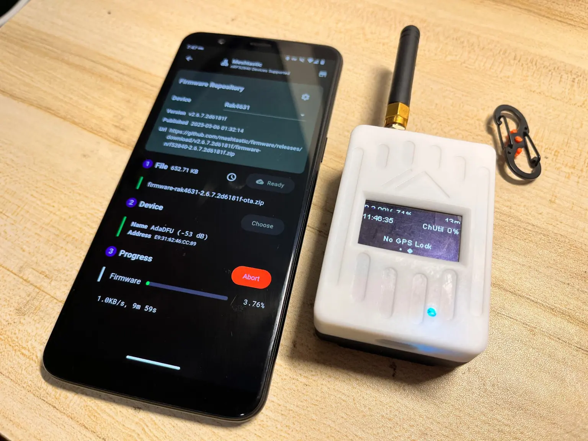

# nRF52 OTA Firmware Updates

MTools BLE provides the unified operation method for Android and iOS clients, and provides convenient features such as fast firmware download and one-click upgrade for nRF52 device DFU.

### Downloads

<figure><figcaption>
GAT562 OTA on MTools BLE
</figcaption></figure>

* [Play Store](https://play.google.com/store/apps/details?id=com.mtoolstec.mtoolsLite)
* [App Store](https://apps.apple.com/us/app/mtools-lite/id1531345398)
* [Learn More](https://shop.mtoolstec.com/mifare-classic-tool-for-ios)

### Steps

1. Go to `Tool` > `Meshtastic Beta` in App.
2. Select the device from list and the firmware will be downloaded.
3. Connect to your nRF52 device.
4. Start to upload the firmware.

### Settings

1. The firmware repository can be set from [github.com/meshtastic/firmware](https://github.com/meshtastic/firmware) to your own repository.
2. Number of packet can be customized, **do not greater than 8**. Or it will result failures.
3. Enable download single firmware will download only the firmware for you device instead of the whole nRF52 package.

### Notice

1. OTA firmware updates come with an increased risk of failure. If the update process fails, your device will be left in a non-working state and require the Drag and Drop actions for recover the firmware.
2. The legacy DFU service can only provide around 1KB/s speed for data transfer. The speed and remaining time will be show when uploading.
3. nRF52 devices from RAK are able to accept OTA firmware updates from a mobile device over bluetooth. Older T-Echo bootloaders do not have OTA support.
